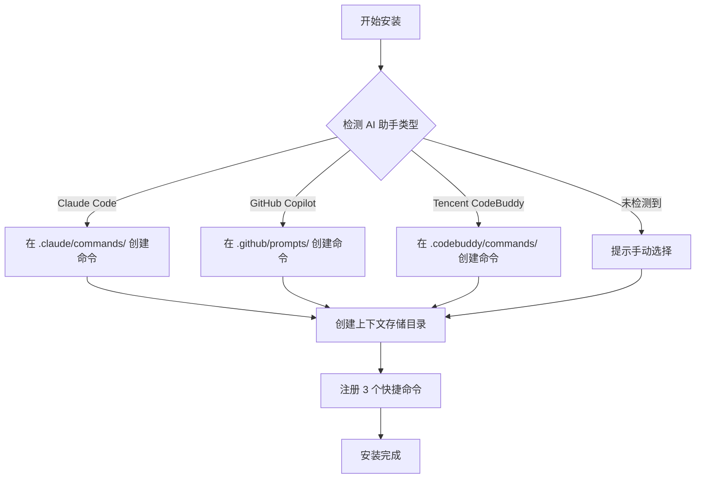
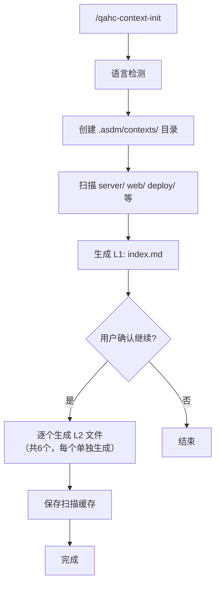
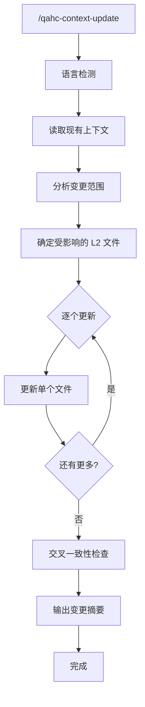
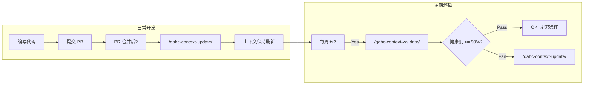
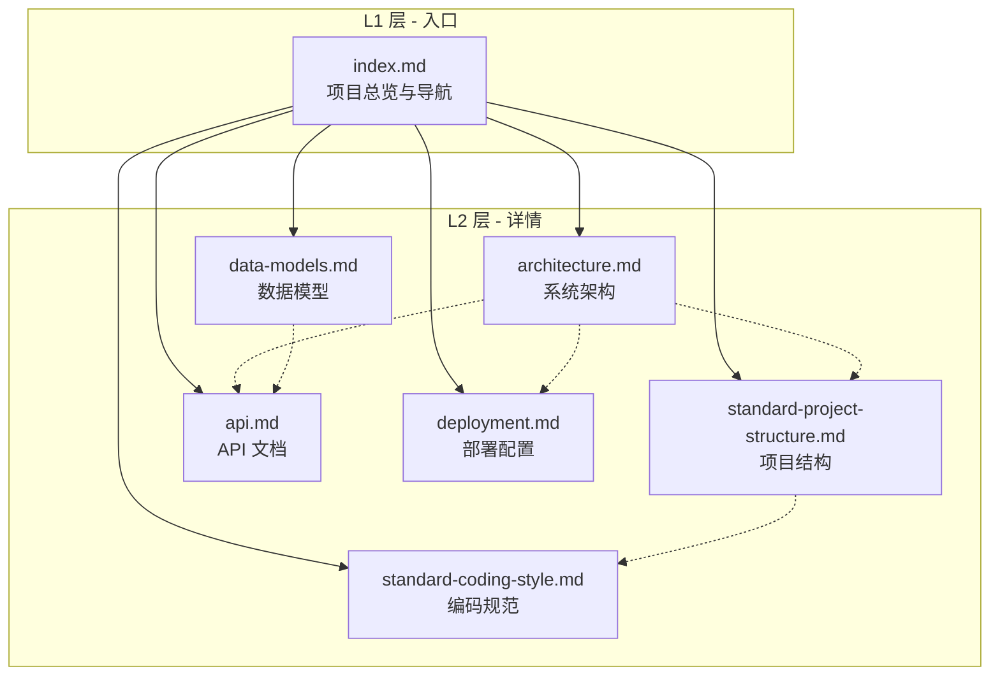

# QA Healthcare 知识工程指导手册

**工具集版本**: 0.0.1 | **更新日期**: 2026-05-16 | **适用项目**: QA Healthcare（qa-healthcare）

---

## 目录

1. [什么是上下文工程？](#1-什么是上下文工程)
2. [为什么需要这套工具？](#2-为什么需要这套工具)
3. [快速开始](#3-快速开始)
4. [安装详解](#4-安装详解)
5. [命令参考](#5-命令参考)
6. [推荐工作流](#6-推荐工作流)
7. [输出文件详解](#7-输出文件详解)
8. [常见问题与排障](#8-常见问题与排障)
9. [附录：目录结构速查](#9-附录目录结构速查)

---

## 1. 什么是上下文工程？

### 1.1 核心概念

**上下文工程（Context Engineering）**，又称**知识工程（Knowledge Engineering）**，是指为 AI 代理（AI Agent）系统化地构建、维护和优化项目知识的过程。就像人类开发者需要阅读文档、了解架构、熟悉代码规范才能高效工作一样，AI 代理同样需要「理解」项目的全貌才能提供高质量的辅助。

本工具集 **QAHC Context Builder** 是专为 QA Healthcare 项目设计的上下文工程工具，它将项目中分散的知识（代码结构、数据模型、API 接口、架构决策等）自动采集并整理成 AI 可直接消费的结构化文档。

### 1.2 L1/L2 两层架构

本工具集采用两层知识组织方式：

```
L1 层（入口层）
├── index.md — 项目全景图 + 导航索引
│              新人/AI 首先阅读此文件即可获得全局认知

L2 层（详细层）
├── standard-project-structure.md  — 项目结构与组织规范
├── standard-coding-style.md       — 编码风格与约定
├── data-models.md                 — 数据模型与关系
├── api.md                         — API 接口定义
├── architecture.md                — 系统架构与技术决策
└── deployment.md                  — 部署配置与流程
```

**设计理念**：
- **L1 = 地图**：快速定位，知道去哪里找信息
- **L2 = 说明书**：每个领域的详细技术文档
- AI 优先读 L1 获得概览，再按需深入 L2 的特定领域

---

## 2. 为什么需要这套工具？

### 2.1 解决的问题

| 问题 | 场景 | 后果 |
|------|------|------|
| AI 不了解项目结构 | 让 AI 写新功能时，它不知道 `server/` 下是多个独立服务 | 生成的代码放在错误的位置 |
| AI 不知道编码规范 | AI 用驼峰命名，但团队用下划线命名 | 代码审查被驳回 |
| API 文档过时 | 新增了端点但上下文未更新 | AI 给出错误的接口调用示例 |
| 架构决策丢失 | 为什么选 Spring Boot 而不是 Quarkus？AI 不知道 | AI 建议了不合适的技术方案 |

### 2.2 使用前后对比

```
使用前：
  你: "帮我写一个用户管理模块的 CRUD"
  AI: "好的，在 src/main/java 下创建 UserController..."
  你: "不对，我们用的是多服务结构，应该在 qa-service-user 下面"
  AI: "抱歉，让我重新生成..."

使用后（已有准确上下文）：
  你: "帮我写一个用户管理模块的 CRUD"
  AI: "根据 standard-project-structure.md，新功能应在
       server/qa-service-user/src/main/java/com/leansofx/qaserviceuser/
       下创建 controller/service/repository 分层。
       按照 standard-coding-style.md 使用 Lombok 注解风格，
       参考 data-models.md 中已有的 User 实体扩展字段。
       是否继续？"
  你: "是的"
```

---

## 3. 快速开始

### 3.1 三步上手

```bash
# 第一步：安装（只需一次）
Follow instructions in .asdm/toolsets/qahc-context-builder/INSTALL.md

# 第二步：初始化上下文（首次或重建）
/qahc-context-init

# 第三步：验证结果是否正确
/qahc-context-validate
```

### 3.2 最小前提条件

- [x] 当前工作区是一个有效的 QA Healthcare 项目（包含 `server/`、`web/` 等目录）
- [x] 已安装 AI 编程助手（CodeBuddy / Claude Code / GitHub Copilot 任一）
- [x] 有读写 `.asdm/` 目录的权限

> **注意**：如果你只是第一次接触这个项目，建议先执行 `/qahc-context-init` 让 AI 为你生成完整的项目上下文。这比你自己逐个翻阅代码要快得多，而且生成的文档可以作为你后续开发的参考。

---

## 4. 安装详解

### 4.1 安装过程概述

安装脚本会完成以下操作：



### 4.2 安装后验证

安装完成后，你应该能看到以下文件：

```bash
# 检查命令是否已注册（以 CodeBuddy 为例）
ls .codebuddy/commands/
# 应该看到：qahc-context-init.md, qahc-context-update.md, qahc-context-validate.md

# 检查上下文目录是否已创建
ls -la .asdm/contexts/
# 应该存在 layer-2/ 子目录
```

### 4.3 多人协作注意事项

- **INSTALL.md 不需要重复执行**：团队成员首次克隆项目后各自行安装一次即可
- **`.asdm/contexts/` 应纳入 Git**：生成的上下文文件是团队共享资产，建议提交到版本控制
- **命令文件不冲突**：不同 AI 助手的命令文件在不同目录下，互不影响

---

## 5. 命令参考

### 5.1 `/qahc-context-init` — 初始化项目上下文

#### 用途
从零开始扫描整个 QA Healthcare 项目，生成完整的 L1/L2 上下文文件。

#### 何时使用
- **首次接入项目**（克隆代码后的第一步）
- **上下文严重过期**（大量重构后，增量更新已不够用）
- **切换分支后**（如从 `main` 切换到一个差异较大的 feature 分支）

#### 执行流程



#### 关键特性
- **分阶段生成**：先生成 L1 入口文件（index.md），确认后再逐个生成 L2 文件。这保证了每个文件的生成质量，避免一次性输出过多导致 Token 耗尽或质量下降。
- **语言自适应**：自动检测环境语言偏好，所有输出统一使用该语言（中文/英文）。
- **基于 Spec 模板**：使用 `specs/` 下的模板作为骨架，填充实际扫描到的内容。

#### 输出清单

| 输出项 | 路径 | 内容 |
|--------|------|------|
| 项目总览 | `.asdm/contexts/index.md` | 技术栈、目录树、构建命令、导航链接 |
| 项目结构 | `.asdm/contexts/layer-2/standard-project-structure.md` | 服务列表、目录用途、命名约定 |
| 编码风格 | `.asdm/contexts/layer-2/standard-coding-style.md` | Java/Vue 规范、注解风格、配置引用 |
| 数据模型 | `.asdm/contexts/layer-2/data-models.md` | 实体定义、ER 图、关系说明 |
| API 文档 | `.asdm/contexts/layer-2/api.md` | 端点表、请求/响应示例、CORS 配置 |
| 架构设计 | `.asdm/contexts/layer-2/architecture.md` | 架构图、组件关系、技术选型理由 |
| 部署配置 | `.asdm/contexts/layer-2/deployment.md` | Dockerfile、编排方式、环境变量 |

#### 示例对话

```
你: /qahc-context-init

AI: [检测语言: 中文]
    正在分析 QA Healthcare 项目结构...
    
    ✓ 发现 server/ 下 2 个服务：qa-service-question, qa-service-user
    ✓ 发现 web/ 前端项目（Vue + Vite + TypeScript）
    ✓ 发现 deploy/ 部署配置
    
    已生成 L1 入口文件：.asdm/contexts/index.md
    
    现在将逐个生成 L2 详细文件（共 6 个）。
    准备生成第 1 个：standard-project-structure.md
    是否继续？(Y/n)

你: Y

AI: ✓ 已生成 standard-project-structure.md
    准备生成第 2 个：standard-coding-style.md
    是否继续？(Y/n)
    
    ... （逐个确认，直到全部完成）
```

---

### 5.2 `/qahc-context-update [范围]` — 增量更新上下文

#### 用途
在代码变更后，只更新受影响的部分上下文文件，保持上下文与实际代码同步。

#### 何时使用
- **迭代结束后**：完成一个 Sprint 或版本发布后
- **重大重构后**：调整了项目结构、修改了数据模型
- **新增服务后**：在 `server/` 下创建了新的 `qa-service-{domain}/`
- **定期维护**：每周或每两周例行同步

#### 参数说明

| 参数 | 说明 | 示例 |
|------|------|------|
| _(无参数)_ | 交互式模式，AI 会询问要更新的范围 | `/qahc-context-update` |
| `full` | 全量重新扫描所有文件 | `/qahc-context-update full` |
| `server` | 仅更新后端相关上下文 | `/qahc-context-update server` |
| `web` | 仅更新前端相关上下文 | `/qahc-context-update web` |
| `api` | 仅更新 API 文档 | `/qahc-context-update api` |

#### 变更映射表

AI 在执行 update 时会根据变更类型自动判断需要更新哪些文件：

| 变更类型 | 自动更新的上下文文件 |
|---------|-------------------|
| 新增/删除 `server/qa-service-{domain}/` | `index.md`, `standard-project-structure.md`, `architecture.md` |
| 修改 Entity 类或数据库 Schema | `data-models.md`, `architecture.md` |
| 新增/修改 Controller 或 API 端点 | `api.md`, `index.md`, `architecture.md` |
| 更改 Dockerfile/docker-compose | `deployment.md`, `architecture.md` |
| 引入新框架或修改编码配置 | `standard-coding-style.md`, `index.md` |
| 调整目录结构或重命名 | `standard-project-structure.md`, `index.md` |

#### 执行流程



#### 示例对话

```
你: /qahc-context-update

AI: [检测语言: 中文]
    正在分析自上次更新以来的变更...
    
    检测到以下变更：
    📁 新增：server/qa-service-order/          → 影响 structure + architecture
    ✏️  修改：qa-service-question/...QuestionController.java  → 影响 api
    🐳 修改：deploy/docker-compose.yml         → 影响 deployment
    
    建议更新以下文件：
    1. standard-project-structure.md  （新增订单服务）
    2. api.md                         （新增问答端点）
    3. deployment.md                  （编排配置变更）
    4. architecture.md                （服务拓扑变化）
    5. index.md                       （目录树更新）
    
    是否全部更新？(Y/n) 或指定编号（如 "1,3"）

你: Y

AI: ✓ standard-project-structure.md 已更新 — 新增 qa-service-order 到已注册服务表
    ✓ api.md 已更新 — 新增 POST /api/questions/{id}/answer 端点
    ✓ deployment.md 已更新 — docker-compose 新增 order 服务
    ✓ architecture.md 已更新 — 服务通信图增加 OrderService
    ✓ index.md 已更新 — 目录树和导航索引同步
    
    📋 变更摘要：
    - 更新文件数：5
    - 新增服务记录：qa-service-order
    - 新增 API 端点：1 个
    - 健康度：✅ 全部一致
```

---

### 5.3 `/qahc-context-validate` — 验证上下文准确性

#### 用途
系统化地检查现有上下文文件与实际代码的一致性，生成带评分的诊断报告。

#### 何时使用
- **AI 辅助异常时**：AI 反复给出错误的代码位置或不存在的类名
- **定期质量巡检**：每周或每两周例行检查
- **合并 PR 前**：确保上下文不会误导其他开发者
- **回滚操作后**：代码回退但上下文未回退的情况

#### 验证模式

| 模式 | 说明 | 触发方式 |
|------|------|---------|
| 全量验证 | 检查所有 7 个上下文文件 | 默认模式 |
| 指定文件 | 只检查指定的 1~N 个文件 | 在对话中指定文件名 |
| 增量验证 | 基于 git diff 范围检查可能受影响的文件 | 传入 git diff 范围 |

#### 检查项清单

AI 对每个文件执行以下检查（具体条目因文件而异）：

**L1: index.md**
- [ ] 文件树是否与实际目录一致
- [ ] 技术栈信息和版本号是否正确
- [ ] 构建/测试命令是否可用
- [ ] L2 文件引用链接是否有效

**L2: standard-project-structure.md**
- [ ] 服务列表（`qa-service-*`）是否与 `server/` 实际一致
- [ ] 目录用途说明是否匹配当前代码
- [ ] 命名约定是否符合实际情况

**L2: data-models.md**
- [ ] Entity 类定义是否存在且字段一致
- [ ] 表关系描述（一对多等）是否正确
- [ ] ER 图是否反映当前数据模型
- [ ] 是否遗漏新增的实体类

**L2: api.md**
- [ ] Controller 中的端点是否全部列出
- [ ] 请求/响应格式是否与源码一致
- [ ] 已删除的端点是否仍在文档中
- [ ] 示例数据是否仍然有效

**L2: architecture.md**
- [ ] 架构组件是否与实际服务对应
- [ ] 组件间关系是否正确
- [ ] 架构图是否反映当前设计

**L2: deployment.md**
- [ ] 部署配置文件是否与仓库一致
- [ ] 环境变量列表是否准确
- [ ] CI/CD 描述是否反映当前状态

**L2: standard-coding-style.md**
- [ ] 编码规范是否反映团队当前实践
- [ ] 引用的配置文件路径是否存在
- [ ] 代码示例是否符合项目实际风格

#### 输出报告

验证完成后会生成诊断报告，保存在：
```
.asdm/workspace/qahc-context/validation-reports/validation-{日期}.md
```

报告格式示例：

```markdown
# 上下文验证报告

**验证时间**：2026-05-16 10:30
**验证范围**：全量
**健康度评分**：87%

## 总览
| 指标 | 数值 |
|------|------|
| 已验证文件数 | 7 |
| 通过 | 4 |
| 警告 | 2 |
| 错误 | 1 |

## ⚠️ 警告
- api.md 第 45 行：缺少新增的 /api/statistics/summary 端点
- deployment.md 第 12 行：端口映射仍写旧值 8091（应为 8083）

## ❌ 错误
- standard-project-structure.md：未列出新增的 qa-service-order 服务

## 建议
1. [高] 运行 /qahc-context-update 修复以上问题
2. [低] 考虑将 validation 加入 CI pre-commit hook
```

#### 示例对话

```
你: /qahc-context-validate

AI: [检测语言: 中文]
    开始全量验证...
    
    验证进度：███████████████████ 100%  (7/7 文件)
    
    📊 验证结果：
    ══════════════════════════════
    健康度评分：87% ⚠️
    ══════════════════════════════
    
    ✅ 通过 (4):
      · index.md
      · standard-coding-style.md
      · data-models.md
      · architecture.md
    
    ⚠️  警告 (2):
      · api.md           — 缺少 1 个新增端点
      · deployment.md    — 端口信息过期
    
    ❌  错误 (1):
      · standard-project-structure.md — 缺少 qa-service-order 服务
    
    📄 完整报告已保存至：
      .asdm/workspace/qahc-context/validation-reports/validation-2026-05-16.md
    
    💡 建议下一步：运行 /qahc-context-update 修复上述 3 个问题
```

---

## 6. 推荐工作流

### 6.1 日常开发工作流



### 6.2 具体的时间线示例

| 时间节点 | 操作 | 原因 |
|---------|------|------|
| **Day 1 - 新成员加入** | `/qahc-context-init` | 从零建立完整上下文 |
| **Day 1 - init 之后** | 阅读 `.asdm/contexts/index.md` | 快速了解项目全貌 |
| **每次迭代结束** | `/qahc-context-update` | 同步本次迭代的变更 |
| **每次大重构后** | `/qahc-context-init` | 重建上下文（增量更新不够用） |
| **AI 回答明显错误时** | `/qahc-context-validate` | 诊断上下文中哪里出了问题 |
| **每周五下午** | `/qahc-context-validate` | 例行质量巡检 |
| **发布新版本前** | `/qahc-context-validate` + `/qahc-context-update` | 确保上下文与发布版一致 |

### 6.3 团队协作建议

| 角色 | 职责 | 频率 |
|------|------|------|
| **Tech Lead** | 执行 `/qahc-context-validate` 审查报告 | 每周 |
| **开发者** | 迭代结束后执行 `/qahc-context-update` | 每次 Sprint 结束 |
| **DevOps** | 新部署配置上线后触发 `/qahc-context-update deploy` | 部署变更时 |
| **新人** | 先跑 `/qahc-context-init` 再读 `index.md` | 入职第一天 |

---

## 7. 输出文件详解

### 7.1 文件之间的关系



### 7.2 各文件的核心价值

| 文件 | 主要读者 | 核心问题它回答 |
|------|---------|---------------|
| `index.md` | 所有人（首选） | 「这个项目是什么？怎么编译？东西在哪？」 |
| `standard-project-structure.md` | 要加新文件/新服务的人 | 「新代码应该放在哪个目录？」 |
| `standard-coding-style.md` | 写代码的人 | 「变量怎么命名？用什么注解风格？」 |
| `data-models.md` | 改数据库/写业务逻辑的人 | 「有哪些实体？它们之间什么关系？」 |
| `api.md` | 前后端联调/写测试的人 | 「有哪些接口？请求响应长什么样？」 |
| `architecture.md` | 做技术选型/系统设计的人 | 「整体架构是怎样的？为什么这么设计？」 |
| `deployment.md` | 运维/部署的人 | «怎么打包？环境变量有哪些？» |

### 7.3 上下文 vs Specs 的区别

很多开发者会混淆这两个目录，这里做一个明确区分：

| 维度 | `specs/` | `contexts/` |
|------|----------|-------------|
| **性质** | 模板（Template） | 产物（Artifact） |
| **内容** | 占位符 + 格式规范 | 真实项目数据 |
| **谁写入** | 工具集作者 | AI 执行命令后生成 |
| **谁修改** | 一般不改（升级工具集时更新） | 通过 update/init 命令刷新 |
| **类比** | Word 模板 (.dotx) | 填好的文档 (.docx) |

简单来说：**`specs/` 是空表格，`contexts/` 是填好数据的表格**。你日常阅读和参考的是 `contexts/` 中的内容。

---

## 8. 常见问题与排障

### Q1: 执行 `/qahc-context-init` 后部分 L2 文件没有生成怎么办？

**原因**：init 采用分阶段交互模式，可能在某个文件生成后你没有选择「继续」。

**解决**：重新执行 `/qahc-context-init`，或者对缺失的文件单独执行 `/qahc-context-update <文件名>`。

### Q2: 验证报告显示健康度很低（< 60%）怎么办？

**原因**：项目经历了大量变更但上下文未及时更新。

**解决**：
1. 先查看验证报告中的错误项详情
2. 如果错误较多，直接执行 `/qahc-context-init` 重建全部上下文
3. 如果只有少量错误，运行 `/qahc-context-update` 修复

### Q3: 团队中有人更新了上下文，我本地怎么同步？

**方法一（推荐）**：将 `.asdm/contexts/` 纳入 Git 版本控制，正常 `git pull` 即可同步。

**方法二**：如果 contexts 未入库，每个人各自执行 `/qahc-context-update` 更新自己的本地副本。

### Q4: 切换 Git 分支后上下文不准确怎么办？

**原因**：不同分支可能有不同的项目结构和代码。

**解决**：切换分支后建议重新执行 `/qahc-context-init`，让 AI 基于当前分支的代码重新生成上下文。

### Q5: AI 生成的内容有错误怎么办？

**原因**：AI 可能误解了某些代码逻辑或配置含义。

**解决**：
1. 直接编辑 `.asdm/contexts/` 中对应的文件修正错误
2. 下次执行 `/qahc-context-update` 时告诉 AI 你的修正，避免覆盖

### Q6: Token 不足导致生成中断怎么办？

**原因**：大型项目的上下文初始化消耗较多 Token。

**解决**：
- init 命令已经采用分阶段生成（每次只生成一个文件），降低单次 Token 消耗
- 如果仍然中断，可以分多次执行 `/qahc-context-update` 逐个补全缺失文件
- 对于超大型项目，考虑在 update 时指定范围参数缩小扫描面

### Q7: 可以自定义上下文的输出内容吗？

**可以**。两种方式：
1. **编辑 specs 模板**：修改 `.asdm/toolsets/qahc-context-builder/specs/` 下的模板文件，添加你想要的章节
2. **直接编辑产物**：修改 `.asdm/contexts/` 下的已生成文件（注意：下次 update 可能覆盖你的修改）

### Q8: 这套工具和其他文档工具（如 Swagger/Javadoc）的关系是什么？

| 工具 | 定位 | 与 QAHC Context Builder 的关系 |
|------|------|-------------------------------|
| Swagger/OpenAPI | API 实时文档（从代码注解生成） | `api.md` 可引用 Swagger URL 作为补充 |
| Javadoc | 代码级文档（类/方法说明） | 本工具集关注的是**项目级**宏观上下文 |
| Wiki/Confluence | 团队知识库（人工维护） | 本工具集是**自动化**的，减少人工维护成本 |
| **QAHC Context Builder** | AI 消费的项目知识 | 整合以上各类信息的**结构化摘要** |

**简而言之**：QAHC Context Builder 不是替代这些工具，而是为 AI 创建一个统一的、可快速消费的项目知识入口。

---

## 9. 附录：目录结构速查

### 9.1 工具集自身结构

```
.asdm/toolsets/qahc-context-builder/
├── README.md                          # 工具集说明（面向开发者）
├── INSTALL.md                         # 安装指南（本文档所在位置的兄弟文件）
├── manifest.json                      # 工具集元数据
├── actions/                           # ★ 命令定义（AI 执行的指令）
│   ├── qahc-context-init.md           #   初始化
│   ├── qahc-context-update.md         #   更新
│   └── qahc-context-validate.md       #   验证
├── specs/                             # ★ 规范模板（生成上下文时的参考基准）
│   ├── layer-1/
│   │   └── index.md                   #   L1 模板
│   └── layer-2/
│       ├── standard-project-structure.md
│       ├── standard-coding-style.md
│       ├── data-models.md
│       ├── api.md
│       ├── architecture.md
│       └── deployment.md
└── docs/
    └── user-guide.md                  # ★ 本文件 — 用户指导手册
```

### 9.2 生成产物的结构

```
.asdm/                                  # ASDM 工作区根
├── contexts/                           # ★ 上下文知识库（AI 读取的目标）
│   ├── index.md                        # L1 — 必读入口
│   └── layer-2/                        # L2 — 详细文档
│       ├── standard-project-structure.md
│       ├── standard-coding-style.md
│       ├── data-models.md
│       ├── api.md
│       ├── architecture.md
│       └── deployment.md
└── workspace/
    └── qahc-context/                   # 运行时工作区
        ├── scan-cache.json             # 扫描缓存（加速后续更新）
        └── validation-reports/         # 历次验证报告
            └── validation-2026-05-16.md
```

### 9.3 命令速查卡

| 做什么 | 用哪个命令 | 一句话说明 |
|--------|-----------|-----------|
| 第一次用 / 全部重来 | `/qahc-context-init` | 扫描整个项目，生成全部 7 个上下文文件 |
| 代码变了，更新一下 | `/qahc-context-update [范围]` | 只更新受影响的文件 |
| 觉得上下文不准了 | `/qahc-context-validate` | 对比上下文 vs 实际代码，给诊断报告 |
| 看项目概况 | 读 `.asdm/contexts/index.md` | 不需要命令，直接打开看 |
| 查看历史验证报告 | 看 `validation-reports/` 目录 | 不需要命令，直接打开看 |

---

*本手册由 QAHC Context Builder 工具集 v0.0.1 提供。如有疑问请查阅 [README](../README.md) 或 [INSTALL.md](../INSTALL.md)。*
