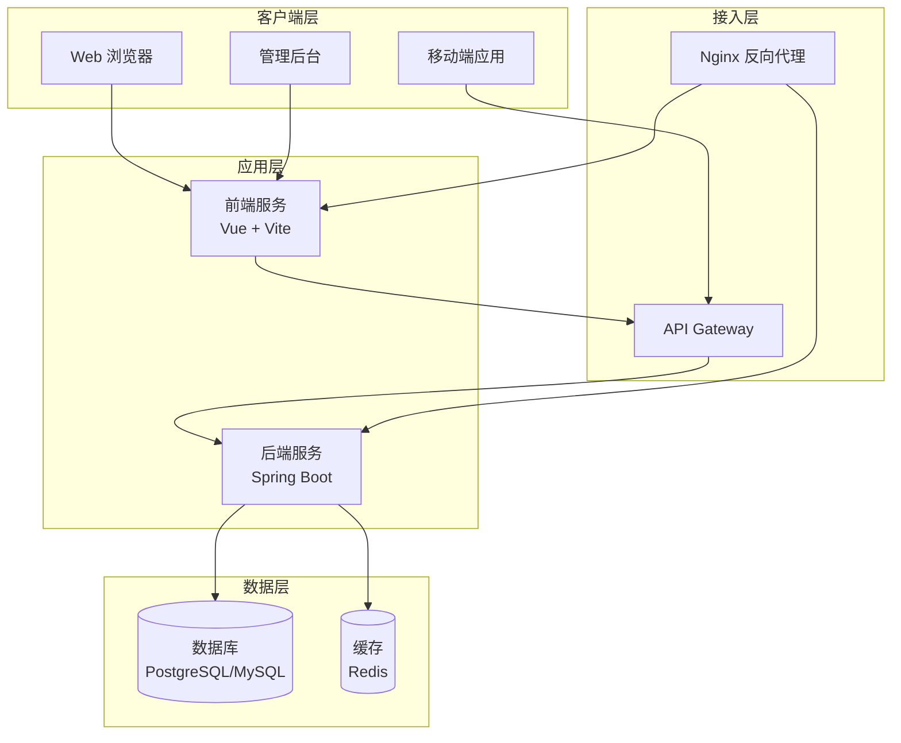
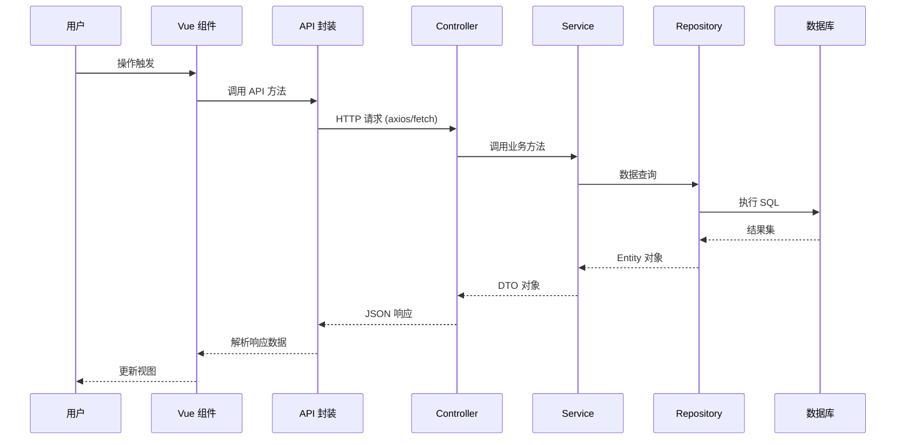
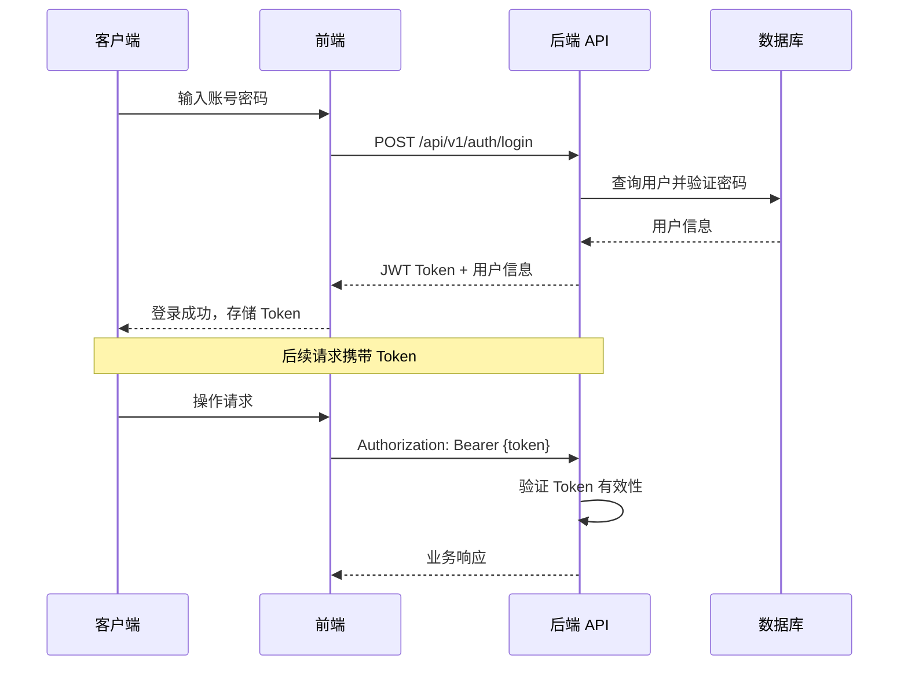

> **⚠️ 模板文件声明**
>
> - **本文件性质**：`.asdm/toolsets/qahc-context-builder/specs/layer-2/architecture.md` 是**规范模板（Spec Template）**，非最终上下文内容。
> - **生成规则**：执行 `/qahc-context-init` 时，AI 应分析项目的整体架构设计（前后端分离方式、服务间通信模式、技术选型决策、安全架构等），结合 `server/` 各服务的依赖关系和 `web/` 的组件架构，绘制真实的架构图和技术选型表，生成完整内容并写入 `.asdm/contexts/layer-2/architecture.md`。
> - **更新规则**：架构发生重大变更（引入新技术栈、重构分层、调整部署拓扑等）时，通过 `/qahc-context-update` 更新已生成的上下文文件。
> - **验证规则**：使用 `/qahc-context-validate` 检查上下文中描述的架构与实际代码实现是否一致。
>
> ---

# 系统架构（L2 层）

## 概述

本文档描述本工作区的整体系统架构、设计决策和技术模式。它为 AI 模型提供对系统结构和设计原则的全面理解。

## 架构总览

### 高层架构图（Mermaid）

> **重要**：AI 生成时应根据实际工作区的技术栈绘制真实架构图。

## 架构原则

### 1. 关注点分离
- **表现层**：处理用户交互和 UI 渲染（Vue 组件）
- **API 层**：RESTful API 设计，处理请求路由和响应
- **服务层**：核心业务逻辑实现
- **数据访问层**：数据持久化和检索（Spring Data JPA）
- **基础设施层**：横切关注点（日志、配置、安全）

### 2. 前后端分离
- 前端 SPA 应用独立部署
- 通过 REST API 进行前后端通信
- 前端负责视图渲染，后端负责数据处理

### 3. 分层架构
```
Controller（控制层）→ Service（服务层）→ Repository（数据层）→ Database
     ↓                ↓                ↓
   参数校验        业务逻辑          SQL/JPQL
   响应组装        事务管理          缓存
```

## 组件详解

### 前端应用
**用途**：用户界面展示和交互
**技术栈**：Vue 3 + TypeScript + Vite + Pinia + Vue Router
**关键组件**：
- 视图层：页面组件（views/pages）
- 可复用组件库（components）
- API 封装层（api/）
- 状态管理（stores/）
- 路由守卫和权限控制

### 后端应用
**用途**：业务逻辑处理和数据管理
**技术栈**：Java 17+ / Spring Boot / Spring Data JPA / Spring Security
**分层结构**：
- **Controller**：接收请求、参数校验、调用 Service
- **Service**：业务逻辑、事务管理
- **Repository**：数据 CRUD 操作
- **Entity/DTO**：数据传输对象转换

### 数据库
**用途**：持久化数据存储
**选择依据**：[根据项目实际情况填写]

## 数据流模式

### 典型请求流程


## 设计模式

### Repository 模式（后端）
```java
public interface UserRepository extends JpaRepository<User, Long> {
    Optional<User> findByEmail(String email);
    boolean existsByEmail(String email);
}

@Service
@RequiredArgsConstructor
public class UserService {
    private final UserRepository userRepository;

    @Transactional
    public User createUser(CreateUserRequest request) {
        // 校验 → 转换 → 持久化
        if (userRepository.existsByEmail(request.getEmail())) {
            throw new ConflictException("邮箱已被注册");
        }
        User user = User.from(request); // DTO → Entity
        return userRepository.save(user);
    }
}
```

### 组合式 API 模式（前端）
```typescript
// composables/useUserList.ts
export function useUserList() {
  const loading = ref(false)
  const data = ref<User[]>([])
  const error = ref<string | null>(null)

  async function fetchUsers(params?: QueryParams) {
    loading.value = true
    try {
      data.value = await userApi.getList(params)
    } catch (e) {
      error.value = (e as Error).message
    } finally {
      loading.value = false
    }
  }

  onMounted(fetchUsers)

  return { loading, data, error, fetchUsers }
}
```

## 安全架构

### 认证流程


### 权限模型
```java
// 基于角色的访问控制
enum Role {
    ADMIN,   // 管理员
    USER,    // 普通用户
    GUEST    // 访客
}

// 权限注解
@PreAuthorize("hasRole('ADMIN')")
@DeleteMapping("/admin/users/{id}")
public void deleteUser(@PathVariable Long id) { ... }
```

## 性能考量

### 缓存策略
- **本地缓存**：Spring Cache + Caffeine（热点数据）
- **分布式缓存**：Redis（共享会话、高频查询结果）
- **HTTP 缓存**：Nginx 静态资源缓存

### 数据库优化
- 合理的索引设计
- 查询优化（避免 N+1 问题）
- 分页查询支持
- 连接池配置调优

## 技术选型总结

| 层面 | 技术 | 选型理由 |
|------|------|----------|
| 前端框架 | Vue 3 + TypeScript | 团队熟悉度、生态成熟度 |
| 构建工具 | Vite | 快速的开发体验 |
| 状态管理 | Pinia | Vue 3 官方推荐 |
| 后端框架 | Spring Boot | 企业级稳定性、生态丰富 |
| ORM | Spring Data JPA | 减少样板代码、类型安全 |
| 数据库 | PostgreSQL / MySQL | 根据项目需求选择 |
| 部署 | Docker + Nginx | 容器化部署、反向代理 |

---

*当发生重大设计变更时，应更新本文档。使用 `/qahc-context-update` 保持内容最新。*
