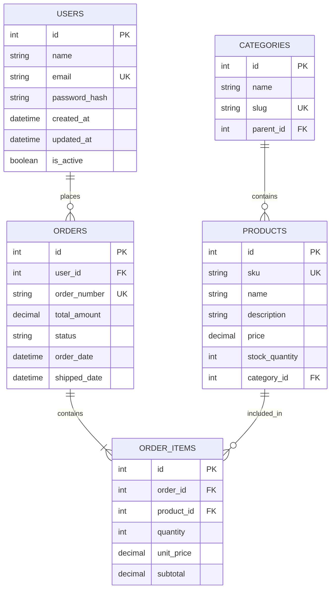
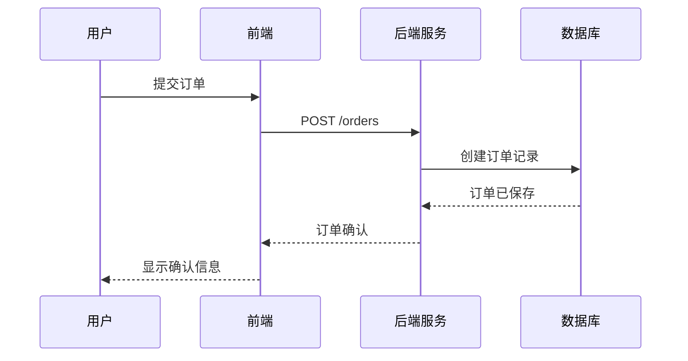

> **⚠️ 模板文件声明**
>
> - **本文件性质**：`.asdm/toolsets/qahc-context-builder/specs/layer-2/data-models.md` 是**规范模板（Spec Template）**，非最终上下文内容。
> - **生成规则**：执行 `/qahc-context-init` 时，AI 应扫描各 `server/qa-service-{domain}/src/main/java/` 下的 Entity 类、Repository 接口和数据库迁移脚本，提取真实的实体定义、字段约束、关联关系和数据校验规则，替换模板中的示例 ER 图和实体定义，生成完整内容并写入 `.asdm/contexts/layer-2/data-models.md`。
> - **更新规则**：数据模型变更（新增实体、修改字段、调整关系等）时，通过 `/qahc-context-update` 同步更新已生成的上下文文件。
> - **验证规则**：使用 `/qahc-context-validate` 对比上下文中的模型定义与源码中 Entity 类是否一致。
>
> ---

# 数据模型（L2 层）

## 概述

本文档描述本工作区的数据模型、关系和数据流。它为 AI 模型提供理解数据结构所需的信息，使其能够有效地与代码库协同工作。

## 数据库概览图

### ER 关系图（Mermaid）

> **注意**：以上为示例模板，AI 在生成时应根据实际工作区的实体替换为真实的 ER 图。

## 实体定义

> 以下模板展示如何描述每个实体。生成时应根据实际代码中的 Entity/Model 类填充。

### 实体名称
**用途**：[描述该实体的作用]

```java
@Entity
@Table(name = "table_name")
public class EntityName {
    @Id @GeneratedValue(strategy = GenerationType.IDENTITY)
    private Long id;

    @Column(nullable = false, unique = true)
    private String uniqueField;

    // ... 其他字段

    // 关联关系
    @ManyToOne
    @JoinColumn(name = "related_id")
    private RelatedEntity relatedEntity;

    @OneToMany(mappedBy = "thisField")
    private List<ChildEntity> children;

    // getter / setter
}
```

**字段说明**：
| 字段 | 类型 | 约束 | 说明 |
|------|------|------|------|
| `id` | Long | PK, 自增 | 主键 |
| ... | ... | ... | ... |

## 数据关系

### 一对多关系
1. **实体 A → 实体 B**：一个 A 可以关联多个 B

### 多对多关系
1. **实体 A ↔ 实体 B**：通过中间表/关联实体实现

### 自引用关系
1. **实体 → 实体自身**：树形结构（如分类层级）

## 数据流图

### 典型业务流程（示例：订单处理）


## 数据校验规则

### 校注示例
```java
public class CreateOrderRequest {
    @NotBlank(message = "用户ID不能为空")
    private Long userId;

    @NotEmpty(message = "订单项不能为空")
    @Size(min = 1, message = "至少包含一个订单项")
    private List<OrderItemRequest> items;

    @Pattern(regexp = "^(PENDING|PAID|SHIPPED)$", message = "无效的订单状态")
    private String status;
}
```

## 示例数据

### JSON 示例
```json
{
  "id": 1,
  "name": "示例数据",
  "status": "ACTIVE",
  "createdAt": "2026-01-15T10:30:00Z"
}
```

## 数据访问模式

### Repository 接口示例
```java
public interface ExampleRepository extends JpaRepository<ExampleEntity, Long> {
    
    // 按条件查询
    List<ExampleEntity> findByStatus(String status);
    
    // 自定义查询
    @Query("SELECT e FROM ExampleEntity e WHERE e.createdAt >= :date")
    List<ExampleEntity findRecent(@Param("date") LocalDateTime date);
    
    // 分页查询
    Page<ExampleEntity> findByNameContaining(String name, Pageable pageable);
}
```

### 查询优化
```sql
-- 常用查询索引
CREATE INDEX idx_table_column ON table_name(column_name);

-- 复合索引（高频联合查询）
CREATE INDEX idx_table_col1_col2 ON table_name(column1, column2);
```

## 数据安全

### 加密策略
- 密码：bcrypt 加密（salt rounds = 10）
- 敏感数据：AES-256 加密存储
- API 密钥：SHA-256 哈希存储

### 访问控制
- 基于角色的访问控制（RBAC）
- 行级安全策略（多租户场景）
- 敏感操作的审计日志

---

*本文档应在数据库模式或数据结构变更时更新。使用 `/qahc-context-update` 保持内容最新。*
