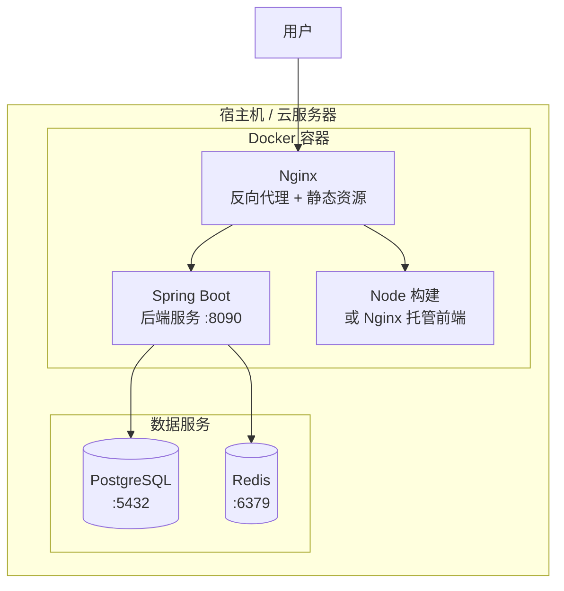

> **⚠️ 模板文件声明**
>
> - **本文件性质**：`.asdm/toolsets/qahc-context-builder/specs/layer-2/deployment.md` 是**规范模板（Spec Template）**，非最终上下文内容。
> - **生成规则**：执行 `/qahc-context-init` 时，AI 应扫描 `deploy/` 目录下的 Dockerfile、docker-compose.yml、Nginx 配置、环境配置文件以及各服务的 `application.yml`，提取真实的部署架构、端口映射、环境变量、编排方式等信息，生成完整部署文档并写入 `.asdm/contexts/layer-2/deployment.md`。
> - **更新规则**：部署配置变更（Dockerfile 修改、环境变量调整、Nginx 规则变化等）时，通过 `/qahc-context-update` 更新已生成的上下文文件。
> - **验证规则**：使用 `/qahc-context-validate` 对比上下文中的部署配置与 `deploy/` 目录下的实际文件是否一致。
>
> ---

# 部署配置（L2 层）

## 概述

本文档描述本工作区的部署架构、配置和流程。它为 AI 模型提供理解和操作部署环境所需的必要信息。

## 部署架构

### 系统部署图（Mermaid）

> **重要**：AI 生成时应根据实际部署环境绘制真实的部署拓扑图。

### 组件说明
| 组件 | 用途 | 技术 | 扩展方式 |
|------|------|------|----------|
| **Nginx** | 反向代理、静态资源托管、SSL 终结 | Nginx / 1.24+ | 水平扩展 |
| **后端服务** | REST API 服务 | Spring Boot / Embedded Tomcat | 水平扩展 |
| **前端应用** | SPA 静态资源 | Vue + Vite Build / Nginx | CDN 分发 |
| **数据库** | 主要数据存储 | PostgreSQL / MySQL | 读写分离 |
| **缓存** | 会话缓存、热点数据 | Redis | Sentinel 集群 |

## 环境配置

### 开发环境
```yaml
# server/src/main/resources/application-dev.yml
server:
  port: 8090

spring:
  datasource:
    url: jdbc:postgresql://localhost:5432/{db_name}
    username: dev_user
    password: dev_password
  jpa:
    hibernate:
      ddl-auto: update
    show-sql: true

logging:
  level:
    root: INFO
    com.example: DEBUG

# 应用自定义配置
app:
  jwt:
    secret: dev-secret-key
    expiration: 86400000
  cors:
    allowed-origins:
      - http://localhost:5173
      - http://localhost:3000
```

### 生产环境
```yaml
# server/src/main/resources/application-prod.yml
server:
  port: 8090

spring:
  datasource:
    url: jdbc:postgresql://${DB_HOST}:${DB_PORT}/${DB_NAME}
    username: ${DB_USERNAME}
    password: ${DB_PASSWORD}
    hikari:
      maximum-pool-size: 20
      minimum-idle: 5
  jpa:
    hibernate:
      ddl-auto: validate
    show-sql: false

logging:
  level:
    root: WARN
    com.example: INFO

app:
  jwt:
    secret: ${JWT_SECRET}
    expiration: 86400000
  cors:
    allowed-origins:
      - https://{domain}
```

### 前端环境变量
```bash
# web/.env.development
VITE_API_BASE_URL=http://localhost:8090/api

# web/.env.production
VITE_API_BASE_URL=https://{domain}/api
```

## 部署流程

### 开发环境部署
```bash
# 启动后端
cd server
./mvnw spring-boot:run -Dspring-boot.run.profiles=dev

# 启动前端（另起终端）
cd web
npm install
npm run dev

# 或使用 Docker Compose 一键启动
docker compose -f docker/docker-compose.dev.yml up -d
```

### 生产环境部署

#### 1. 构建应用
```bash
# 构建后端 JAR
cd server
./mvnw clean package -DskipTests -Pprod

# 构建前端
cd web
npm run build

# 前端产物在 dist/ 目录
```

#### 2. Docker 镜像构建
```dockerfile
# Dockerfile（后端）
FROM eclipse-temurin:17-jre-alpine
WORKDIR /app
COPY target/*.jar app.jar
EXPOSE 8090
ENTRYPOINT ["java", "-jar", "app.jar"]
```

```dockerfile
# Dockerfile（前端）
FROM node:18-alpine AS builder
WORKDIR /app
COPY package*.json ./
RUN npm ci
COPY . .
RUN npm run build

FROM nginx:alpine
COPY --from=builder /app/dist /usr/share/nginx/html
COPY nginx.conf /etc/nginx/conf.d/default.conf
EXPOSE 80
```

#### 3. Docker Compose 编排
```yaml
# docker/docker-compose.prod.yml
version: '3.8'
services:
  nginx:
    image: nginx:alpine
    ports:
      - "80:80"
      - "443:443"
    volumes:
      - ./nginx.conf:/etc/nginx/nginx.conf
      - ./ssl:/etc/nginx/ssl
      - web-dist:/usr/share/nginx/html
    depends_on:
      - backend

  backend:
    build:
      context: ../server
      dockerfile: Dockerfile
    environment:
      - SPRING_PROFILES_ACTIVE=prod
      - DB_HOST=db
      - DB_PORT=5432
      - DB_NAME=${DB_NAME}
      - DB_USERNAME=${DB_USERNAME}
      - DB_PASSWORD=${DB_PASSWORD}
    ports:
      - "8090:8090"
    depends_on:
      - db
      - redis

  db:
    image: postgres:16-alpine
    environment:
      - POSTGRES_DB=${DB_NAME}
      - POSTGRES_USER=${DB_USERNAME}
      - POSTGRES_PASSWORD=${DB_PASSWORD}
    volumes:
      - pgdata:/var/lib/postgresql/data
    ports:
      - "5432:5432"

  redis:
    image: redis:7-alpine
    command: redis-server --requirepass ${REDIS_PASSWORD}
    volumes:
      - redisdata:/data
    ports:
      - "6379:6379"

volumes:
  pgdata:
  redisdata:
  web-dist:
```

#### 4. 部署步骤
```bash
# 构建所有服务镜像
docker compose -f docker/docker-compose.prod.yml build

# 启动所有服务
docker compose -f docker/docker-compose.prod.yml up -d

# 查看服务状态
docker compose -f docker/docker-compose.prod.yml ps

# 查看日志
docker compose -f docker/docker-compose.prod.yml logs -f backend

# 执行数据库迁移（如需要）
docker compose -f docker/docker-compose.prod.yml exec backend java -jar app.jar --migrate
```

## Nginx 配置

```nginx
# nginx.conf
worker_processes auto;

events {
    worker_connections 1024;
}

http {
    include       mime.types;
    default_type  application/json;

    # 上游后端服务
    upstream backend {
        server backend:8090;
    }

    # Gzip 压缩
    gzip on;
    gzip_types text/plain text/css application/json application/javascript text/xml;

    # HTTP → HTTPS 重定向
    server {
        listen 80;
        server_name _;
        return 301 https://$host$request_uri;
    }

    # HTTPS 主服务
    server {
        listen 443 ssl;
        server_name your-domain.com;

        ssl_certificate     /etc/nginx/ssl/fullchain.pem;
        ssl_certificate_key /etc/nginx/ssl/privkey.pem;

        # 前端静态资源
        location / {
            root /usr/share/nginx/html;
            index index.html;
            try_files $uri $uri/ /index.html;  # Vue Router history 模式
        }

        # API 反向代理
        location /api/ {
            proxy_pass http://backend;
            proxy_set_header Host $host;
            proxy_set_header X-Real-IP $remote_addr;
            proxy_set_header X-Forwarded-For $proxy_add_x_forwarded_for;
            proxy_set_header X-Forwarded-Proto $scheme;
        }
    }
}
```

## 监控与健康检查

### Spring Boot Actuator
```yaml
# application.yml 中启用
management:
  endpoints:
    web:
      exposure:
        include: health,info,metrics,prometheus
  endpoint:
    health:
      show-details: when_authorized
```

### 健康检查端点
- `GET /actuator/health` — 服务健康状态
- `GET /actuator/info` — 应用信息
- `GET /actuator/metrics` — 运行指标

## 部署检查清单

### 部署前
- [ ] 所有测试通过
- [ ] 代码审查完成
- [ ] 安全扫描通过
- [ ] 数据库迁移脚本准备就绪
- [ ] 回滚计划已制定

### 部署中
- [ ] 先部署到预发布环境
- [ ] 冒烟测试通过
- [ ] 监控指标正常
- [ ] 功能验证完成

### 部署后
- [ ] 监控错误率
- [ ] 检查性能指标
- [ ] 验证备份
- [ ] 更新部署日志
- [ ] 通知相关人员

## 故障排查

### 常见问题

#### 数据库连接失败
```bash
# 检查数据库连通性
docker compose exec db pg_isready

# 检查连接池状态
# 查看 actuator /metrics 端点中的 datasource 信息
```

#### 应用启动失败
```bash
# 查看容器日志
docker compose logs backend

# 检查资源使用情况
docker stats

# 进入容器排查
docker compose exec backend sh
```

---

*当基础设施或部署流程发生变化时，应更新本文档。使用 `/qahc-context-update` 保持内容最新。*
